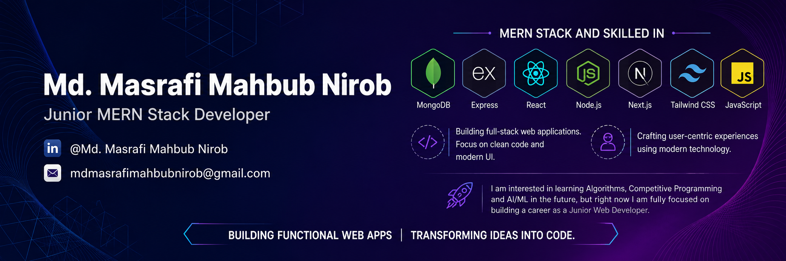

<!--- banner --->

 

# Hi there, I'm Md. Masrafi Mahbub Nirob 👋

I'm a passionate **Junior MERN Stack Developer** dedicated to building responsive and user-centric web applications. Currently, my primary focus is on transitioning my skills into a professional environment.

### 👨‍💻 About Me
- I’m currently focused on building full-stack applications using the **MERN** stack and refining my frontend skills with tools like **Tailwind CSS**.
- I love working on practical projects. Through building applications like a full-featured **GitHub Issue Tracker**, I have learned how to write clean code, manage version control effectively, and solve real-world logic problems.
- **My Future Goals:** While web development is my main expertise right now, I have a strong enthusiasm for algorithmic problem-solving. Once I establish myself in a professional developer role, I plan to dive deeper into **Competitive Programming** (C++) to further sharpen my analytical skills.
- Ask me about **JavaScript, React, Tailwind CSS, or Web Development basics**.

 

## 💻 Tech Stack & Tools
### Languages: *HTML5, CSS3, JavaScript (ES6+)*
  

### Frontend: *React.js, Next.js, Tailwind CSS*

### Backend: *Node.js, Express.js*

### Database: *MongoDB*

### Tools: *Git, Github, VScode*

 

## 📫 Reach me at:

